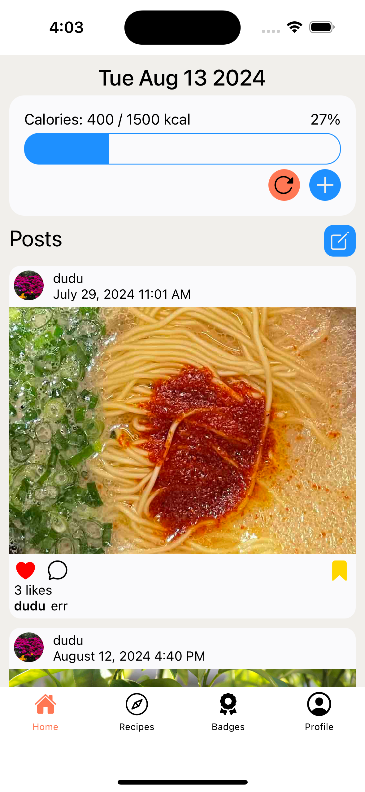
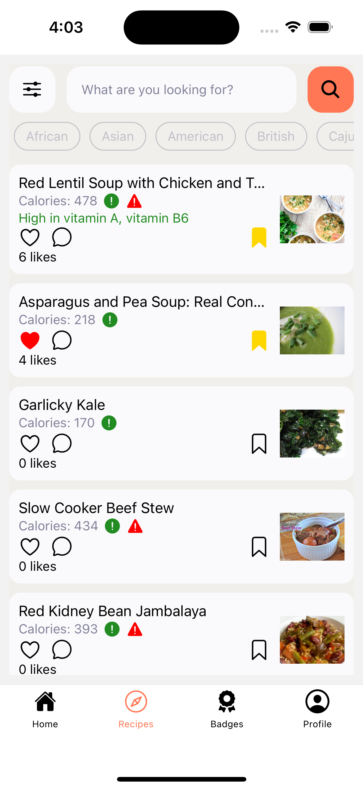

# Dumo Eats

DumoEats is a mobile app which aims to help users adopt a healthier lifestyle. We provide users with food choices based on their health preferences and a platform to track and monitor calories easily. Users are able to interact with each other by creating posts and liking or commenting on posts or recipes. Recipes are from Spoonacular API.

## Deployment link on Expo Go

https://expo.dev/preview/update?message=Final&updateRuntimeVersion=1.0.0&createdAt=2024-08-13T07%3A16%3A51.687Z&slug=exp&projectId=45c86e06-b0c3-478f-aee0-504df2d0fd70&group=89d2f574-65bf-40cf-9a7a-83543274b1d9

## Screenshots

| Home screen                                                                  | Recipe recommendation screen                                                                 |
|:----------------------------------------------------------------------------:|:--------------------------------------------------------------------------------------------:|
|  |  |

## Running the app locally

1. Install dependencies for the project by entering this command:

```bash
cd Frontend
```

```bash
npm install
```

2. Run the app in development mode by entering this command:

```bash
npx expo start
```

